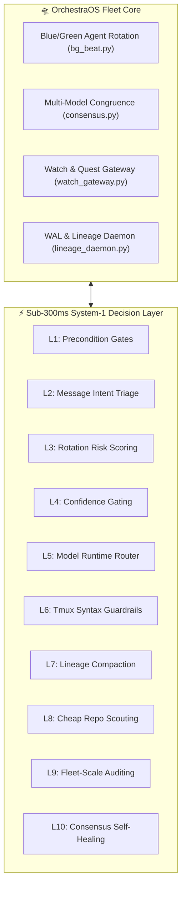

# ⚡ 10 Levels of Jev for OrchestraOS

> **A high-speed, sub-300ms structured decision engine and autonomous fleet optimization architecture.**  
> Adapted specifically from Daniel Disler's (*disler/ten-levels-of-jev*) framework for the **OrchestraOS** multi-agent operating system.

[](https://orchestraos-10-levels-of-jev.netlify.app)
[](LICENSE)
[](https://python.org)

---

## 🏛️ System Architecture



---

## 🚀 The 10 Levels Mapped to OrchestraOS

| Level | Name | OrchestraOS Integration | Core Defect / Failure Mode Solved |
|---|---|---|---|
| **L1** | **Fast Boolean Gate** | `bg_beat.py` & `precondition_gate()` | Replaces 5-second LLM reasoning with a ~250ms check on PID presence and drained WAL deltas. |
| **L2** | **Multiple Choice Triage** | `msg_store.py` & `watch_gateway.py` | Categorizes incoming fleet messages (`P0_OUTAGE`, `CONGRUENCE_VOTE`, `QUESTIONNAIRE`) in real-time. |
| **L3** | **Composite Risk Scoring** | `rotation_autonomy.py` | Computes multi-factor risk (context saturation %, git uncommitted diff churn, idle time) to prevent context blowout. |
| **L4** | **Confidence Threshold Gate** | `execute_tmux_repin()` | Gating destructive actions: $>0.92$ auto-executes; $<0.92$ routes to human approval card on Watch/Quest. |
| **L5** | **Multi-Runtime Routing** | `agent_dispatcher.py` | Cost/speed router: lightweight tasks to Gemini 2.5 Flash / Local MLX, heavy refactoring to Claude 3.7 Opus. |
| **L6** | **Invisible Guardrail Hook** | `agent_runtime.py` `pre_tool_hook()` | Intercepts raw shell commands and rewrites bare tmux targets (`-t P-g1`) into exact targets (`-t =P-g1`). |
| **L7** | **Context Compaction Hook** | `lineage_daemon.py` | Turn-end hook checking token density; compresses past conversation history to WAL before context limits. |
| **L8** | **Cheap Reads** | `repo_scout.py` | Evaluates missing helper signatures across 50+ repo files without loading raw files into the LLM context. |
| **L9** | **Fleet-Scale Scouting** | `fleet_audit.py` | Concurrent background audit of all 14 active seats for drift, zombie husks, and dead sockets. |
| **L10** | **Agentic Self-Healing** | `consensus_autodrive.py` | Detects consensus deadlocks caused by dead voter seats, auto-synthesizes fallback quorum, and unblocks pipeline. |

---

## 🛠️ Quickstart & Verification

```bash
# Clone the repository
git clone https://github.com/ShawCole/orchestraos-10-levels-of-jev.git
cd orchestraos-10-levels-of-jev

# Install dependencies
pip install -r requirements.txt

# Run the 10-level automated verification suite
python -m pytest tests/test_10_levels.py -v

# Run the live benchmark evaluator
python src/orchestra_jev_evaluator.py --level 3 --simulate
```

---

## 👥 Authors & Collaborators
- **Target Architecture:** OrchestraOS Fleet System (VPS `srv1397016`)
- **Key Collaborators:** Shaw Cole & Viorel
- **Inspiration:** Daniel Disler (`disler/ten-levels-of-jev`) & TypeSafe System-1
